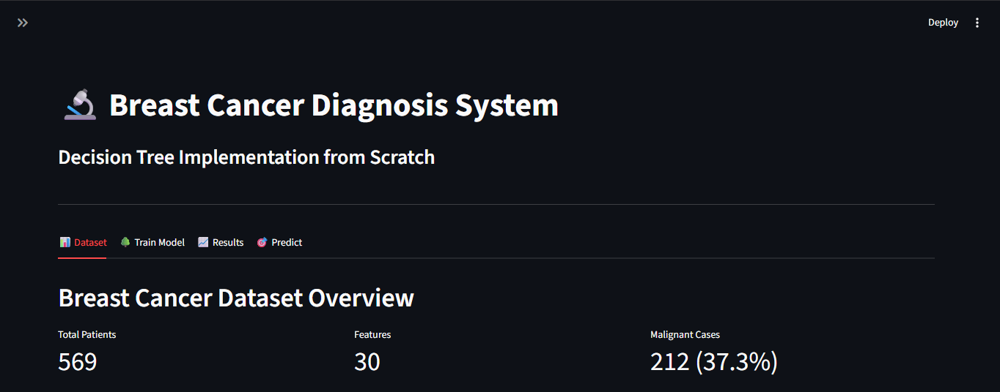
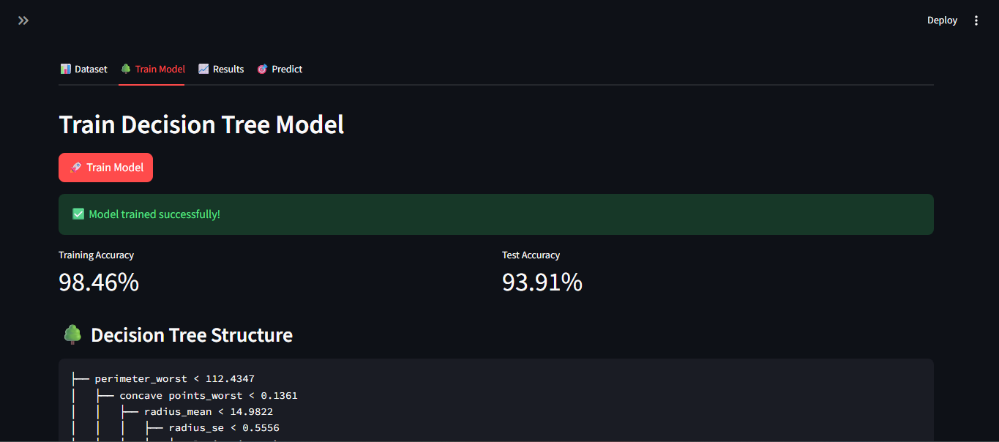
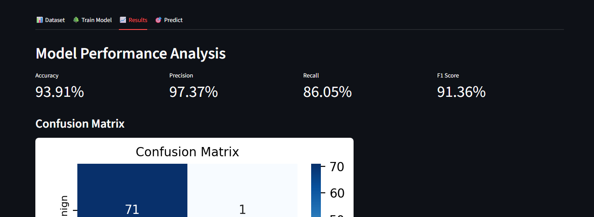
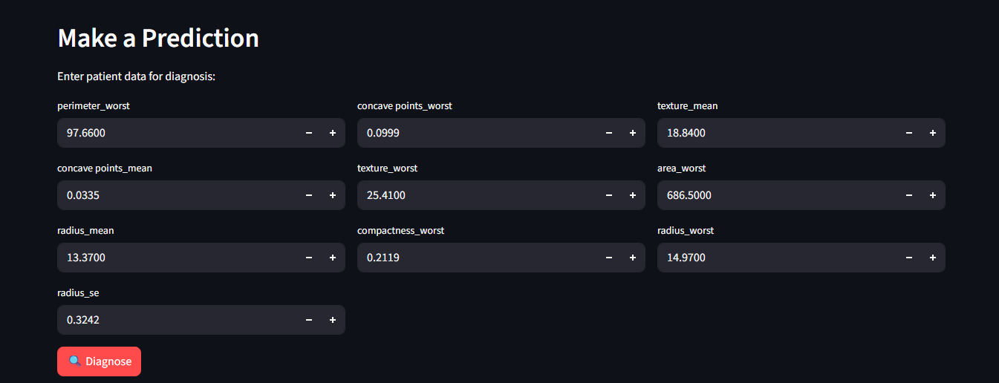

# Breast Cancer Diagnosis with Streamlit Decision Tree (From Scratch)

This project provides an interactive Streamlit app that trains and evaluates a custom Decision Tree for breast cancer diagnosis using pure Python, NumPy, and pandas.

## Project Files

- app.py - Main Streamlit app
- data/breast-cancer.csv - Dataset used by the app
- requirements.txt - Python dependencies
- breast-cancer-classification.ipynb - Optional notebook version

## What app.py Includes

- Custom Decision Tree implementation from scratch (no scikit-learn tree)
- Impurity and split logic (majority impurity, Gini, entropy, information gain)
- Stratified train/test split
- Tree training, prediction, and recursive structure building
- Node counting utility for model size
- Feature importance calculation from split gains
- Streamlit UI with four tabs:
	- Dataset: overview metrics, correlation analysis, sample records
	- Train Model: parameter controls, model training, tree text visualization
	- Results: accuracy/precision/recall/F1, compact confusion matrix, clinical interpretation, feature-importance table
	- Predict: manual patient input with model diagnosis output

## Requirements

- Python 3.9+
- Dependencies listed in requirements.txt

## Setup

1. Open a terminal in this folder.
2. (Optional) Create and activate a virtual environment.
3. Install dependencies:

```bash
pip install -r requirements.txt
```

## Run the App

```bash
streamlit run app.py
```

Then open the local Streamlit URL shown in the terminal.

## Screenshots

Add screenshots in a `screenshots/` folder at the project root and update file names if needed.

### Dataset Tab



### Train Model Tab



### Results Tab



### Predict Tab



## Data Preparation in app.py

The app loads data from data/breast-cancer.csv and applies:

1. Remove id when present
2. Remove Unnamed: 32 when present
3. Encode diagnosis as binary target: M -> 1, B -> 0

## Learning Objective

This project is designed to help understand how Decision Trees work internally (split search, impurity reduction, recursion, and prediction) while using a practical interactive interface.
